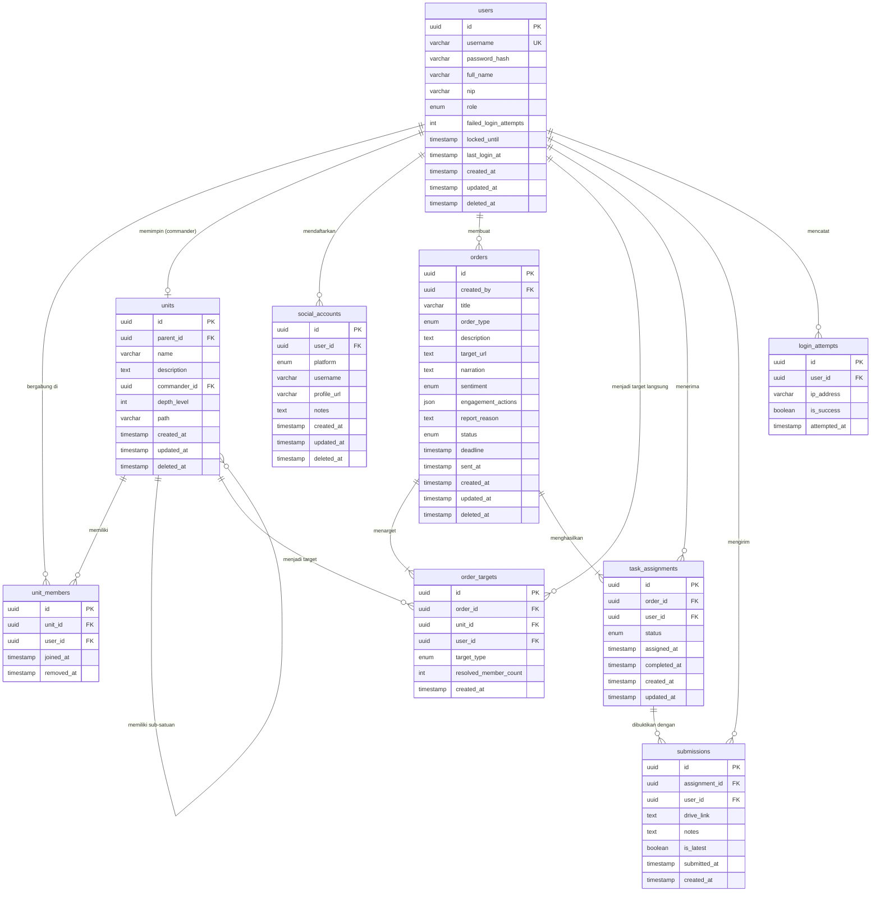

# Entity Relationship Diagram (ERD)
# KOMANDO CENTER — Social Media Command Management System

---

| Field         | Detail                                              |
|---------------|-----------------------------------------------------|
| **Dokumen**   | Entity Relationship Diagram Specification           |
| **Versi**     | v1.0                                                |
| **Tanggal**   | 16 Juni 2026                                        |
| **Author**    | System Analyst                                      |
| **Status**    | Draft                                               |
| **Referensi** | Use Case & Use Scenario v1.0                        |

### Revision History

| Versi | Tanggal    | Deskripsi              | Author         |
|-------|------------|------------------------|----------------|
| v1.0  | 16-06-2026 | Initial ERD draft      | System Analyst |

---

## 1. Identifikasi Entitas

| Entitas               | Sumber Use Case               | Keterangan                                                           |
|-----------------------|-------------------------------|----------------------------------------------------------------------|
| `users`               | UC-03, UC-20                  | Semua user sistem: Admin, Komandan, Anggota                         |
| `units`               | UC-01, UC-02                  | Satuan organisasi — self-referencing tree (adjacency list)          |
| `unit_members`        | UC-04                         | Junction table: relasi user ke satuan                               |
| `social_accounts`     | UC-05, UC-06, UC-07, UC-08    | Akun sosial media yang didaftarkan oleh user                        |
| `orders`              | UC-09, UC-12, UC-13           | Perintah yang dibuat oleh Komandan                                  |
| `order_targets`       | UC-10                         | Target satuan/anggota yang dipilih untuk perintah                   |
| `task_assignments`    | UC-11, UC-14, UC-15, UC-16    | Assignment perintah ke anggota individual (hasil broadcast)         |
| `submissions`         | UC-15                         | Bukti pelaksanaan yang disubmit anggota (link Drive)                |
| `login_attempts`      | UC-20                         | Log percobaan login untuk lockout mechanism                         |

---

## 2. ERD Diagram (Mermaid)



---

## 3. Detail Entitas & Atribut

---

### 3.1 `users`

Menyimpan seluruh akun user dalam sistem: Super Admin, Komandan, dan Anggota. Role ditentukan secara dinamis berdasarkan posisi di hierarki, namun `role` field tetap digunakan untuk Super Admin yang berdiri di luar struktur organisasi.

| Column                  | Data Type       | Constraints                          | Keterangan                                                      |
|-------------------------|-----------------|--------------------------------------|-----------------------------------------------------------------|
| `id`                    | UUID            | PK, DEFAULT gen_random_uuid()        | Primary key                                                     |
| `username`              | VARCHAR(50)     | NOT NULL, UNIQUE                     | Username untuk login — unik di seluruh sistem                  |
| `password_hash`         | VARCHAR(255)    | NOT NULL                             | Password di-hash menggunakan bcrypt                             |
| `full_name`             | VARCHAR(150)    | NOT NULL                             | Nama lengkap user                                               |
| `nip`                   | VARCHAR(50)     | NULL, UNIQUE                         | Nomor identitas/NIP (opsional, unik jika diisi)                |
| `role`                  | ENUM            | NOT NULL, DEFAULT 'member'           | Nilai: `super_admin`, `member` — komandan ditentukan dari tree  |
| `failed_login_attempts` | SMALLINT        | NOT NULL, DEFAULT 0                  | Counter percobaan login gagal berturutan                        |
| `locked_until`          | TIMESTAMP       | NULL                                 | Akun terkunci sampai waktu ini (NULL = tidak terkunci)          |
| `last_login_at`         | TIMESTAMP       | NULL                                 | Timestamp login terakhir berhasil                               |
| `created_at`            | TIMESTAMP       | NOT NULL, DEFAULT NOW()              | Waktu akun dibuat                                               |
| `updated_at`            | TIMESTAMP       | NOT NULL, DEFAULT NOW()              | Waktu data terakhir diupdate                                    |
| `deleted_at`            | TIMESTAMP       | NULL                                 | Soft delete — NULL berarti aktif                                |

**Indexes:**
- `idx_users_username` ON `username`
- `idx_users_deleted_at` ON `deleted_at`

**Relationships:**
- Has many: `unit_members` (user bergabung di banyak satuan — namun hanya boleh aktif di 1 satuan)
- Has many: `social_accounts`
- Has many: `orders` (sebagai pembuat)
- Has many: `task_assignments` (sebagai penerima)
- Has many: `submissions`
- Has many: `login_attempts`
- Has one (optional): `units.commander_id` (jika user adalah komandan suatu satuan)

**Notes:**
- `role = super_admin`: User yang mengelola sistem, tidak terikat hierarki satuan
- `role = member`: Semua user lain — apakah dia bertindak sebagai Komandan atau Anggota ditentukan secara runtime berdasarkan ada/tidaknya child node di `units`

---

### 3.2 `units`

Menyimpan struktur satuan organisasi sebagai **adjacency list tree** — setiap satuan bisa memiliki parent satuan (kecuali root). Mendukung hierarki n-level secara fleksibel.

| Column          | Data Type       | Constraints                        | Keterangan                                                          |
|-----------------|-----------------|------------------------------------|---------------------------------------------------------------------|
| `id`            | UUID            | PK, DEFAULT gen_random_uuid()      | Primary key                                                         |
| `parent_id`     | UUID            | FK → units.id, NULL                | ID satuan parent — NULL berarti satuan ini adalah root              |
| `name`          | VARCHAR(150)    | NOT NULL                           | Nama satuan                                                         |
| `description`   | TEXT            | NULL                               | Deskripsi satuan (opsional)                                         |
| `commander_id`  | UUID            | FK → users.id, NULL                | User yang menjadi komandan satuan ini                               |
| `depth_level`   | SMALLINT        | NOT NULL, DEFAULT 0                | Level kedalaman dalam tree (root = 0, child = 1, dst.)             |
| `path`          | VARCHAR(1000)   | NOT NULL                           | Materialized path: `/root-id/parent-id/this-id/` untuk query cepat |
| `created_at`    | TIMESTAMP       | NOT NULL, DEFAULT NOW()            | Waktu satuan dibuat                                                 |
| `updated_at`    | TIMESTAMP       | NOT NULL, DEFAULT NOW()            | Waktu data terakhir diupdate                                        |
| `deleted_at`    | TIMESTAMP       | NULL                               | Soft delete                                                         |

**Indexes:**
- `idx_units_parent_id` ON `parent_id`
- `idx_units_path` ON `path` (untuk prefix query rekursif)
- `idx_units_commander_id` ON `commander_id`

**Relationships:**
- Self-referencing: `parent_id` → `units.id` (parent satuan)
- Has many: `units` (sub-satuan)
- Has many: `unit_members`
- Belongs to (optional): `users` via `commander_id`

**Notes tentang `path` (Materialized Path):**

Field `path` menyimpan rangkaian ID dari root hingga node saat ini, contoh:
```
Root Satuan A      → path: /uuid-a/
Sub-Satuan B       → path: /uuid-a/uuid-b/
Sub-Sub-Satuan C   → path: /uuid-a/uuid-b/uuid-c/
```
Query "ambil semua anggota di bawah Satuan A" cukup dengan:
```sql
WHERE path LIKE '/uuid-a/%'
```
Ini menghindari recursive CTE yang berat untuk broadcast perintah ke ribuan anggota.

---

### 3.3 `unit_members`

Junction table yang menghubungkan user ke satuan. Satu user idealnya aktif di 1 satuan pada satu waktu, tapi tabel ini menyimpan histori perpindahan satuan.

| Column        | Data Type   | Constraints                        | Keterangan                                           |
|---------------|-------------|-------------------------------------|------------------------------------------------------|
| `id`          | UUID        | PK, DEFAULT gen_random_uuid()       | Primary key                                          |
| `unit_id`     | UUID        | FK → units.id, NOT NULL             | Satuan yang diikuti                                  |
| `user_id`     | UUID        | FK → users.id, NOT NULL             | User anggota                                         |
| `joined_at`   | TIMESTAMP   | NOT NULL, DEFAULT NOW()             | Waktu user bergabung ke satuan ini                   |
| `removed_at`  | TIMESTAMP   | NULL                                | Waktu user dikeluarkan/pindah — NULL = masih aktif   |

**Unique Constraint:**
- `UNIQUE (unit_id, user_id)` WHERE `removed_at IS NULL` — user hanya bisa aktif di 1 satuan yang sama sekaligus

**Indexes:**
- `idx_unit_members_unit_id` ON `unit_id`
- `idx_unit_members_user_id` ON `user_id`
- `idx_unit_members_active` ON `(unit_id, user_id)` WHERE `removed_at IS NULL`

**Relationships:**
- Belongs to: `units`
- Belongs to: `users`

---

### 3.4 `social_accounts`

Menyimpan akun sosial media yang didaftarkan oleh setiap user (anggota maupun komandan).

| Column        | Data Type    | Constraints                        | Keterangan                                                     |
|---------------|--------------|------------------------------------|----------------------------------------------------------------|
| `id`          | UUID         | PK, DEFAULT gen_random_uuid()      | Primary key                                                    |
| `user_id`     | UUID         | FK → users.id, NOT NULL            | Pemilik akun sosmed                                            |
| `platform`    | ENUM         | NOT NULL                           | Nilai: `instagram`, `twitter_x`, `facebook`, `tiktok`, `youtube`, `other` |
| `username`    | VARCHAR(150) | NOT NULL                           | Username/handle akun (contoh: @namaakun)                      |
| `profile_url` | TEXT         | NULL                               | URL langsung ke profil (opsional)                              |
| `notes`       | TEXT         | NULL                               | Catatan tambahan (contoh: akun utama, akun cadangan)          |
| `created_at`  | TIMESTAMP    | NOT NULL, DEFAULT NOW()            | Waktu didaftarkan                                              |
| `updated_at`  | TIMESTAMP    | NOT NULL, DEFAULT NOW()            | Waktu terakhir diupdate                                        |
| `deleted_at`  | TIMESTAMP    | NULL                               | Soft delete                                                    |

**Indexes:**
- `idx_social_accounts_user_id` ON `user_id`
- `idx_social_accounts_platform` ON `platform`

**Relationships:**
- Belongs to: `users`

---

### 3.5 `orders`

Menyimpan perintah sosial media yang dibuat oleh Komandan. Field `narration`, `sentiment`, `engagement_actions`, dan `report_reason` diisi kondisional sesuai `order_type`.

| Column               | Data Type    | Constraints                        | Keterangan                                                                       |
|----------------------|--------------|------------------------------------|----------------------------------------------------------------------------------|
| `id`                 | UUID         | PK, DEFAULT gen_random_uuid()      | Primary key                                                                      |
| `created_by`         | UUID         | FK → users.id, NOT NULL            | Komandan yang membuat perintah                                                   |
| `title`              | VARCHAR(255) | NOT NULL                           | Judul perintah                                                                   |
| `order_type`         | ENUM         | NOT NULL                           | Nilai: `posting`, `engagement`, `komentar`, `report_akun`                       |
| `description`        | TEXT         | NOT NULL                           | Instruksi lengkap / deskripsi perintah                                           |
| `target_url`         | TEXT         | NOT NULL                           | URL postingan/akun sosmed yang jadi target                                       |
| `narration`          | TEXT         | NULL                               | Narasi/caption/komentar yang harus digunakan (untuk `posting` dan `komentar`)   |
| `sentiment`          | ENUM         | NULL                               | Nilai: `positive`, `negative` — hanya untuk `order_type = komentar`             |
| `engagement_actions` | JSON         | NULL                               | Array aksi untuk engagement: `["like", "share", "repost"]` — hanya untuk `engagement` |
| `report_reason`      | TEXT         | NULL                               | Alasan report — hanya untuk `order_type = report_akun`                          |
| `status`             | ENUM         | NOT NULL, DEFAULT 'draft'          | Nilai: `draft`, `aktif`, `selesai`, `expired`, `dibatalkan`                     |
| `deadline`           | TIMESTAMP    | NOT NULL                           | Batas waktu pelaksanaan perintah                                                 |
| `sent_at`            | TIMESTAMP    | NULL                               | Waktu perintah dikirim (status berubah dari draft → aktif)                      |
| `created_at`         | TIMESTAMP    | NOT NULL, DEFAULT NOW()            | Waktu perintah dibuat                                                            |
| `updated_at`         | TIMESTAMP    | NOT NULL, DEFAULT NOW()            | Waktu terakhir diupdate                                                          |
| `deleted_at`         | TIMESTAMP    | NULL                               | Soft delete                                                                      |

**Indexes:**
- `idx_orders_created_by` ON `created_by`
- `idx_orders_status` ON `status`
- `idx_orders_deadline` ON `deadline`

**Relationships:**
- Belongs to: `users` via `created_by`
- Has many: `order_targets`
- Has many: `task_assignments`

**Constraint tambahan:**
- `CHECK (deadline > sent_at + INTERVAL '1 hour')` — deadline minimal 1 jam setelah perintah dikirim (BR-010)

---

### 3.6 `order_targets`

Menyimpan daftar target yang dipilih Komandan saat membuat perintah — bisa berupa satuan (node) atau anggota individual. Ini adalah input sebelum proses broadcast rekursif (UC-11) menghasilkan `task_assignments`.

| Column                  | Data Type   | Constraints                        | Keterangan                                                              |
|-------------------------|-------------|-------------------------------------|-------------------------------------------------------------------------|
| `id`                    | UUID        | PK, DEFAULT gen_random_uuid()       | Primary key                                                             |
| `order_id`              | UUID        | FK → orders.id, NOT NULL            | Perintah yang memiliki target ini                                       |
| `unit_id`               | UUID        | FK → units.id, NULL                 | Target berupa satuan — NULL jika target adalah anggota individual       |
| `user_id`               | UUID        | FK → users.id, NULL                 | Target berupa anggota individual — NULL jika target adalah satuan       |
| `target_type`           | ENUM        | NOT NULL                            | Nilai: `unit`, `individual`                                             |
| `resolved_member_count` | INT         | NULL                                | Jumlah anggota yang berhasil di-resolve saat broadcast (untuk audit)    |
| `created_at`            | TIMESTAMP   | NOT NULL, DEFAULT NOW()             | Waktu target dipilih                                                    |

**Unique Constraint:**
- `UNIQUE (order_id, unit_id)` WHERE `unit_id IS NOT NULL`
- `UNIQUE (order_id, user_id)` WHERE `user_id IS NOT NULL`

**Check Constraint:**
- `CHECK ((unit_id IS NOT NULL AND user_id IS NULL) OR (unit_id IS NULL AND user_id IS NOT NULL))` — hanya salah satu yang boleh terisi

**Indexes:**
- `idx_order_targets_order_id` ON `order_id`
- `idx_order_targets_unit_id` ON `unit_id`

**Relationships:**
- Belongs to: `orders`
- Belongs to (optional): `units`
- Belongs to (optional): `users`

---

### 3.7 `task_assignments`

Hasil dari proses broadcast rekursif — satu record per anggota per perintah. Ini adalah "to-do list" yang terlihat oleh anggota di halaman "Perintah Saya".

| Column          | Data Type   | Constraints                        | Keterangan                                                              |
|-----------------|-------------|-------------------------------------|-------------------------------------------------------------------------|
| `id`            | UUID        | PK, DEFAULT gen_random_uuid()       | Primary key                                                             |
| `order_id`      | UUID        | FK → orders.id, NOT NULL            | Perintah yang di-assign                                                 |
| `user_id`       | UUID        | FK → users.id, NOT NULL             | Anggota yang menerima assignment                                        |
| `status`        | ENUM        | NOT NULL, DEFAULT 'belum_dikerjakan'| Nilai: `belum_dikerjakan`, `selesai`, `terlambat`                      |
| `assigned_at`   | TIMESTAMP   | NOT NULL, DEFAULT NOW()             | Waktu assignment dibuat (saat broadcast)                                |
| `completed_at`  | TIMESTAMP   | NULL                                | Waktu status berubah ke `selesai` atau `terlambat`                     |
| `created_at`    | TIMESTAMP   | NOT NULL, DEFAULT NOW()             | Waktu record dibuat                                                     |
| `updated_at`    | TIMESTAMP   | NOT NULL, DEFAULT NOW()             | Waktu terakhir diupdate                                                 |

**Unique Constraint:**
- `UNIQUE (order_id, user_id)` — satu anggota hanya boleh punya 1 assignment per perintah (BR-012)

**Indexes:**
- `idx_task_assignments_order_id` ON `order_id`
- `idx_task_assignments_user_id` ON `user_id`
- `idx_task_assignments_status` ON `status`
- `idx_task_assignments_order_user` ON `(order_id, user_id)` — composite untuk lookup cepat

**Relationships:**
- Belongs to: `orders`
- Belongs to: `users`
- Has many: `submissions`

---

### 3.8 `submissions`

Menyimpan bukti pelaksanaan yang disubmit anggota berupa link Google Drive. Mendukung resubmit — field `is_latest` menandai mana bukti yang paling baru.

| Column           | Data Type   | Constraints                        | Keterangan                                                                      |
|------------------|-------------|-------------------------------------|---------------------------------------------------------------------------------|
| `id`             | UUID        | PK, DEFAULT gen_random_uuid()       | Primary key                                                                     |
| `assignment_id`  | UUID        | FK → task_assignments.id, NOT NULL  | Assignment yang dibuktikan                                                      |
| `user_id`        | UUID        | FK → users.id, NOT NULL             | User yang mengirim bukti (denormalized untuk kemudahan query)                  |
| `drive_link`     | TEXT        | NOT NULL                            | URL Google Drive berisi bukti pelaksanaan                                       |
| `notes`          | TEXT        | NULL                                | Catatan tambahan dari anggota (opsional)                                        |
| `is_latest`      | BOOLEAN     | NOT NULL, DEFAULT TRUE              | TRUE = ini submission terbaru; FALSE = sudah digantikan (histori resubmit)      |
| `submitted_at`   | TIMESTAMP   | NOT NULL, DEFAULT NOW()             | Waktu submission dikirim — digunakan untuk menentukan tepat waktu / terlambat   |
| `created_at`     | TIMESTAMP   | NOT NULL, DEFAULT NOW()             | Waktu record dibuat                                                             |

**Indexes:**
- `idx_submissions_assignment_id` ON `assignment_id`
- `idx_submissions_user_id` ON `user_id`
- `idx_submissions_latest` ON `(assignment_id, is_latest)` WHERE `is_latest = TRUE`

**Relationships:**
- Belongs to: `task_assignments`
- Belongs to: `users`

**Notes tentang Resubmit:**
Saat user melakukan resubmit, logikanya:
1. `UPDATE submissions SET is_latest = FALSE WHERE assignment_id = ? AND is_latest = TRUE`
2. `INSERT INTO submissions (..., is_latest = TRUE) VALUES (...)`

Histori semua submission tetap tersimpan; query untuk tampilan selalu menggunakan `WHERE is_latest = TRUE`.

---

### 3.9 `login_attempts`

Menyimpan log setiap percobaan login untuk keperluan lockout mechanism dan audit keamanan.

| Column          | Data Type    | Constraints                        | Keterangan                            |
|-----------------|--------------|------------------------------------|---------------------------------------|
| `id`            | UUID         | PK, DEFAULT gen_random_uuid()      | Primary key                           |
| `user_id`       | UUID         | FK → users.id, NULL                | User yang mencoba login — NULL jika username tidak ditemukan |
| `ip_address`    | VARCHAR(45)  | NOT NULL                           | IP address pengirim request (support IPv6) |
| `is_success`    | BOOLEAN      | NOT NULL                           | TRUE = login berhasil, FALSE = gagal  |
| `attempted_at`  | TIMESTAMP    | NOT NULL, DEFAULT NOW()            | Waktu percobaan login                 |

**Indexes:**
- `idx_login_attempts_user_id` ON `user_id`
- `idx_login_attempts_attempted_at` ON `attempted_at`

---

## 4. Ringkasan Relasi Antar Entitas

| Relasi                                        | Tipe  | Keterangan                                                                       |
|-----------------------------------------------|-------|----------------------------------------------------------------------------------|
| `users` → `unit_members`                      | 1:N   | Satu user bisa punya histori bergabung di beberapa satuan                        |
| `units` → `unit_members`                      | 1:N   | Satu satuan bisa memiliki banyak anggota                                         |
| `units` → `units` (self-ref via `parent_id`)  | 1:N   | Satu satuan bisa memiliki banyak sub-satuan (tree rekursif)                      |
| `users` → `units` (via `commander_id`)        | 1:0..1| Satu user bisa memimpin satu satuan (opsional)                                   |
| `users` → `social_accounts`                   | 1:N   | Satu user bisa mendaftarkan banyak akun sosmed                                   |
| `users` → `orders`                            | 1:N   | Satu Komandan bisa membuat banyak perintah                                       |
| `orders` → `order_targets`                    | 1:N   | Satu perintah bisa menarget banyak satuan/anggota                                |
| `units` → `order_targets`                     | 1:N   | Satu satuan bisa jadi target di banyak perintah                                  |
| `users` → `order_targets`                     | 1:N   | Satu user bisa jadi target individual di banyak perintah                         |
| `orders` → `task_assignments`                 | 1:N   | Satu perintah menghasilkan banyak assignment (1 per anggota)                     |
| `users` → `task_assignments`                  | 1:N   | Satu anggota bisa punya banyak assignment dari berbagai perintah                 |
| `task_assignments` → `submissions`            | 1:N   | Satu assignment bisa punya banyak submission (untuk support resubmit + histori)  |
| `users` → `submissions`                       | 1:N   | Satu user bisa punya banyak submission (denormalized)                            |
| `users` → `login_attempts`                    | 1:N   | Satu user bisa punya banyak log percobaan login                                  |

---

## 5. ENUM Value Reference

| Entitas           | Column               | Nilai ENUM                                                                    |
|-------------------|----------------------|-------------------------------------------------------------------------------|
| `users`           | `role`               | `super_admin`, `member`                                                       |
| `social_accounts` | `platform`           | `instagram`, `twitter_x`, `facebook`, `tiktok`, `youtube`, `other`           |
| `orders`          | `order_type`         | `posting`, `engagement`, `komentar`, `report_akun`                            |
| `orders`          | `sentiment`          | `positive`, `negative`                                                        |
| `orders`          | `status`             | `draft`, `aktif`, `selesai`, `expired`, `dibatalkan`                          |
| `order_targets`   | `target_type`        | `unit`, `individual`                                                          |
| `task_assignments`| `status`             | `belum_dikerjakan`, `selesai`, `terlambat`                                    |

---

## 6. Pola Query Kritis

### 6.1 Ambil semua anggota aktif di bawah suatu satuan (untuk broadcast)

Menggunakan materialized `path` pada tabel `units` — jauh lebih cepat dibanding recursive CTE untuk hierarki dalam:

```sql
-- Ambil semua user aktif di bawah satuan dengan id = :target_unit_id
SELECT DISTINCT um.user_id
FROM unit_members um
JOIN units u ON um.unit_id = u.id
WHERE u.path LIKE (
    SELECT path || '%'
    FROM units
    WHERE id = :target_unit_id
)
AND um.removed_at IS NULL
AND u.deleted_at IS NULL;
```

### 6.2 Ambil semua assignment milik seorang anggota (halaman "Perintah Saya")

```sql
SELECT
    ta.id,
    ta.status,
    ta.assigned_at,
    o.title,
    o.order_type,
    o.target_url,
    o.deadline,
    o.narration,
    o.sentiment,
    o.engagement_actions,
    s.drive_link AS submitted_link,
    s.submitted_at
FROM task_assignments ta
JOIN orders o ON ta.order_id = o.id
LEFT JOIN submissions s ON s.assignment_id = ta.id AND s.is_latest = TRUE
WHERE ta.user_id = :current_user_id
  AND o.deleted_at IS NULL
ORDER BY
    CASE ta.status WHEN 'belum_dikerjakan' THEN 0 ELSE 1 END,
    o.deadline ASC;
```

### 6.3 Ambil progress submission per perintah (dashboard Komandan)

```sql
SELECT
    o.id AS order_id,
    o.title,
    o.deadline,
    o.status,
    COUNT(ta.id)                                                    AS total_assigned,
    COUNT(CASE WHEN ta.status != 'belum_dikerjakan' THEN 1 END)    AS total_submitted,
    COUNT(CASE WHEN ta.status = 'selesai' THEN 1 END)              AS total_on_time,
    COUNT(CASE WHEN ta.status = 'terlambat' THEN 1 END)            AS total_late,
    COUNT(CASE WHEN ta.status = 'belum_dikerjakan' THEN 1 END)     AS total_pending
FROM orders o
JOIN task_assignments ta ON ta.order_id = o.id
JOIN units u ON (
    -- Hanya tampilkan perintah yang dibuat oleh Komandan ini
    -- atau perintah yang targetnya masuk dalam cakupan hierarki Komandan
    o.created_by = :commander_id
)
WHERE o.deleted_at IS NULL
GROUP BY o.id, o.title, o.deadline, o.status
ORDER BY o.deadline DESC;
```

### 6.4 Cek apakah user adalah Komandan (memiliki bawahan)

```sql
-- Komandan = punya sub-satuan ATAU punya anggota di satuan yang dia pimpin
SELECT EXISTS (
    SELECT 1 FROM units
    WHERE commander_id = :user_id
      AND deleted_at IS NULL
) AS is_commander;
```

---

## 7. Normalization Checklist

| NF    | Status | Catatan                                                                              |
|-------|--------|--------------------------------------------------------------------------------------|
| **1NF** | ✅   | Semua kolom atomik. `engagement_actions` pakai JSON (array of string) — valid karena tidak perlu query individual per item |
| **2NF** | ✅   | Tidak ada partial dependency. Semua non-key kolom bergantung penuh pada PK           |
| **3NF** | ✅   | Tidak ada transitive dependency. `user_id` di `submissions` adalah intentional denormalization untuk query performa |

---

## 8. Catatan Desain

### 8.1 Kenapa UUID bukan Auto-increment INT?

UUID dipilih karena:
- ID tidak bisa ditebak/di-enumerate oleh user (keamanan)
- Mendukung distribusi data di masa depan jika diperlukan
- Konsisten dengan best practice modern untuk sistem berbasis API

### 8.2 Kenapa Soft Delete (`deleted_at`)?

Soft delete digunakan di entitas utama (`users`, `units`, `social_accounts`, `orders`) karena:
- Mempertahankan histori dan audit trail
- Perintah yang sudah dibuat tetap bisa dilihat meskipun satuan dihapus
- Submission yang sudah ada tetap valid meskipun user dinonaktifkan

### 8.3 Kenapa Materialized Path di `units`?

Tree hierarki organisasi bisa sangat dalam (n-level). Pilihan implementasi:

| Metode              | Query Descendant | Update Tree | Cocok Untuk         |
|---------------------|-----------------|-------------|---------------------|
| Adjacency List      | Lambat (recursive CTE) | Mudah | Tree dangkal        |
| Nested Set          | Cepat | Sangat berat | Read-heavy, jarang update |
| **Materialized Path** | **Cepat (LIKE prefix)** | **Sedang** | **Hierarki dinamis** ✅ |
| Closure Table       | Cepat | Sedang | Query kompleks      |

Materialized Path dipilih karena keseimbangan antara performa read (broadcast perintah) dan kemudahan update (Admin sering reorganisasi satuan).

### 8.4 Kenapa `order_targets` dipisahkan dari `orders`?

Memisahkan target ke tabel tersendiri memungkinkan:
- Audit trail yang jelas: siapa yang ditarget vs siapa yang benar-benar dapat assignment
- Multi-target dalam 1 perintah (beberapa satuan + beberapa individu sekaligus)
- Menyimpan `resolved_member_count` sebagai snapshot jumlah anggota saat perintah dikirim

### 8.5 Kenapa `submissions` mendukung multiple records per assignment?

Untuk mendukung fitur **resubmit** (BR-017) sekaligus mempertahankan **histori semua submission**. Field `is_latest = TRUE` menandai submission yang aktif, sisanya tersimpan sebagai audit trail.

---

## 9. Suggested Next Steps

Setelah ERD ini disetujui, langkah selanjutnya:

1. **Database Migration Script** — implementasi DDL (CREATE TABLE) berbasis ERD ini menggunakan PostgreSQL
2. **API Specification** — rancang endpoint REST berbasis entitas ini: `POST /orders`, `GET /assignments/me`, `POST /assignments/:id/submit`, `POST /social-accounts`
3. **Wireframe / UI Flow** — desain halaman berdasarkan query kritis di Section 6
4. **Seed Data** — buat data awal untuk testing: struktur satuan dummy, user test, perintah sample
