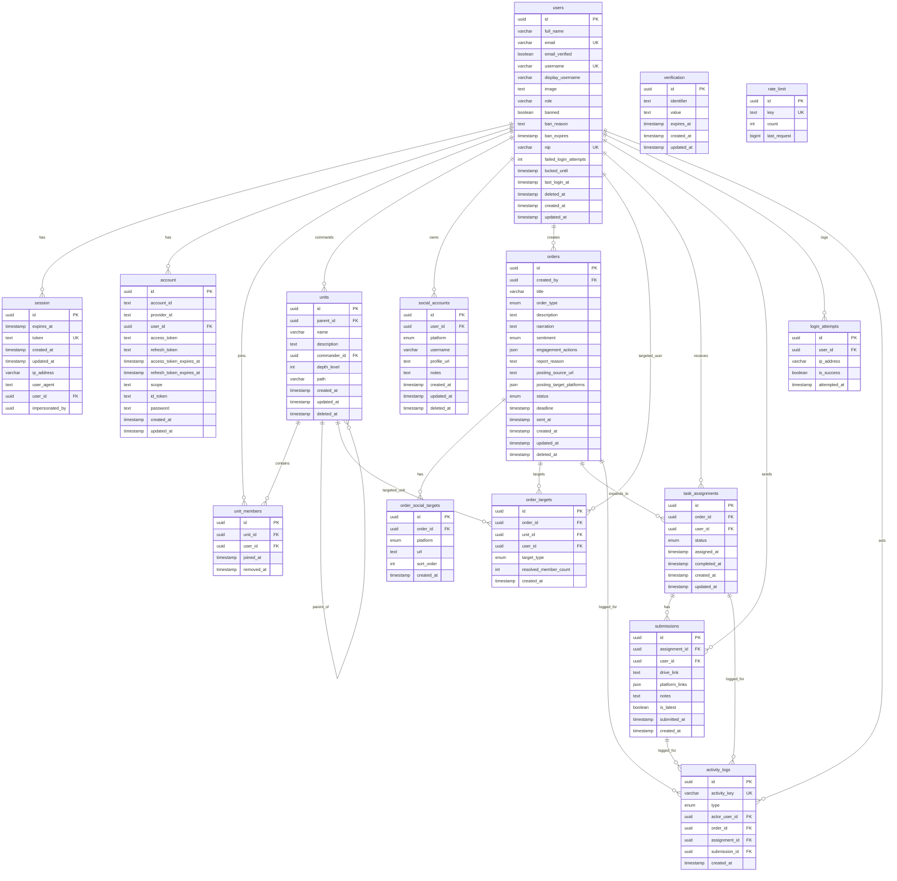

# ERD Sistem Terimplementasi
# KOMANDO CENTER

---

| Field | Detail |
|---|---|
| Dokumen | ERD Sistem Terimplementasi |
| Versi | v2.0 |
| Tanggal | 20 Juni 2026 |
| Sumber Acuan | `apps/api/prisma/schema.prisma` |
| Cakupan | Domain bisnis + tabel autentikasi + tabel aktivitas |

## 1. Ringkasan Entitas

ERD saat ini terdiri dari tiga kelompok besar:

1. **Autentikasi dan keamanan**
   - `users`
   - `session`
   - `account`
   - `verification`
   - `rate_limit`
   - `login_attempts`

2. **Domain Komando Center**
   - `units`
   - `unit_members`
   - `social_accounts`
   - `orders`
   - `order_social_targets`
   - `order_targets`
   - `task_assignments`
   - `submissions`

3. **Audit aktivitas**
   - `activity_logs`

## 2. ERD Mermaid

## 3. Detail Entitas

### 3.1 `users`

Menyimpan identitas user sistem, status keamanan akun, dan soft delete.

| Kolom | Tipe | Catatan |
|---|---|---|
| `id` | UUID | primary key |
| `full_name` | varchar(150) | nama lengkap |
| `email` | varchar(255) | unique |
| `email_verified` | boolean | default `true` |
| `username` | varchar(50) | unique, dipakai login |
| `display_username` | varchar(150), nullable | nama tampil |
| `image` | text, nullable | avatar |
| `role` | varchar(50) | `super_admin` atau `member` |
| `banned` | boolean | status banned |
| `ban_reason` | text, nullable | alasan banned |
| `ban_expires` | timestamp, nullable | batas akhir banned |
| `nip` | varchar(50), nullable | unique jika diisi |
| `failed_login_attempts` | int | counter gagal login |
| `locked_until` | timestamp, nullable | lockout sampai waktu ini |
| `last_login_at` | timestamp, nullable | login terakhir berhasil |
| `deleted_at` | timestamp, nullable | soft delete |
| `created_at` | timestamp | default now |
| `updated_at` | timestamp | auto update |

**Index penting:**
- `users_email_key`
- `users_username_key`
- `users_nip_key`
- index `deleted_at`
- index `role`

### 3.2 `session`

Menyimpan session login aktif dari Better Auth.

| Kolom | Tipe | Catatan |
|---|---|---|
| `id` | UUID | primary key |
| `expires_at` | timestamp | masa berlaku session |
| `token` | text | unique |
| `ip_address` | varchar(45), nullable | alamat IP |
| `user_agent` | text, nullable | user agent |
| `user_id` | UUID | FK ke `users.id` |
| `impersonated_by` | UUID, nullable | dukungan impersonasi bila dipakai |

**Relasi:** banyak session ke satu user, `onDelete: Cascade`.

### 3.3 `account`

Menyimpan akun provider autentikasi. Saat ini dipakai juga untuk provider `username`.

| Kolom | Tipe | Catatan |
|---|---|---|
| `id` | UUID | primary key |
| `account_id` | text | identitas akun pada provider |
| `provider_id` | text | provider login |
| `user_id` | UUID | FK ke `users.id` |
| `password` | text, nullable | password hash internal Better Auth |
| token columns | text/timestamp | kolom OAuth tersedia untuk pengembangan lanjut |

**Constraint:** unique gabungan `provider_id + account_id`.

### 3.4 `verification`

Menyimpan token verifikasi dari Better Auth.

| Kolom | Tipe | Catatan |
|---|---|---|
| `id` | UUID | primary key |
| `identifier` | text | subject verifikasi |
| `value` | text | token/value |
| `expires_at` | timestamp | masa berlaku |

### 3.5 `rate_limit`

Tabel rate limiting bawaan auth.

| Kolom | Tipe | Catatan |
|---|---|---|
| `id` | UUID | primary key |
| `key` | text | unique |
| `count` | int | hit counter |
| `last_request` | bigint | waktu request terakhir |

### 3.6 `units`

Menyimpan struktur organisasi bertingkat dengan adjacency list plus materialized path.

| Kolom | Tipe | Catatan |
|---|---|---|
| `id` | UUID | primary key |
| `parent_id` | UUID, nullable | parent satuan |
| `name` | varchar(150) | unik per parent |
| `description` | text, nullable | deskripsi |
| `commander_id` | UUID, nullable | user yang memimpin satuan |
| `depth_level` | int | root = 0 |
| `path` | varchar(1000) | materialized path |
| `created_at` | timestamp | default now |
| `updated_at` | timestamp | auto update |
| `deleted_at` | timestamp, nullable | soft delete |

**Constraint dan index:**
- unique `parent_id + name`
- index `parent_id`
- index `commander_id`
- index `path`
- index `deleted_at`

### 3.7 `unit_members`

Junction antara user dan satuan, sekaligus menyimpan histori perpindahan.

| Kolom | Tipe | Catatan |
|---|---|---|
| `id` | UUID | primary key |
| `unit_id` | UUID | FK ke `units.id` |
| `user_id` | UUID | FK ke `users.id` |
| `joined_at` | timestamp | waktu bergabung |
| `removed_at` | timestamp, nullable | null berarti membership aktif |

Catatan implementasi:
- tidak ada unique constraint di schema untuk histori, tetapi service menjaga hanya satu membership aktif per user pada satu waktu.

### 3.8 `social_accounts`

Menyimpan akun sosial media milik user.

| Kolom | Tipe | Catatan |
|---|---|---|
| `id` | UUID | primary key |
| `user_id` | UUID | FK ke `users.id` |
| `platform` | enum `SocialPlatform` | `instagram`, `twitter_x`, `facebook`, `tiktok`, `youtube`, `other` |
| `username` | varchar(150) | handle akun |
| `profile_url` | text, nullable | link profil |
| `notes` | text, nullable | catatan |
| `created_at` | timestamp | default now |
| `updated_at` | timestamp | auto update |
| `deleted_at` | timestamp, nullable | soft delete |

### 3.9 `orders`

Entitas utama perintah yang dibuat komandan.

| Kolom | Tipe | Catatan |
|---|---|---|
| `id` | UUID | primary key |
| `created_by` | UUID | FK ke `users.id` |
| `title` | varchar(255) | judul perintah |
| `order_type` | enum `OrderType` | `posting`, `engagement`, `counter`, `report_akun` |
| `description` | text | instruksi utama |
| `narration` | text, nullable | narasi/caption/counter |
| `engagement_actions` | json, nullable | aksi engagement |
| `report_reason` | text, nullable | alasan report |
| `posting_source_url` | text, nullable | sumber materi posting |
| `posting_target_platforms` | json, nullable | platform target posting |
| `status` | enum `OrderStatus` | `draft`, `aktif`, `selesai`, `expired`, `dibatalkan` |
| `deadline` | timestamp | batas waktu |
| `sent_at` | timestamp, nullable | waktu kirim |
| `created_at` | timestamp | default now |
| `updated_at` | timestamp | auto update |
| `deleted_at` | timestamp, nullable | soft delete |

**Catatan model:**
- order `posting` tidak memakai `order_social_targets`
- order non-posting bisa punya banyak `order_social_targets`

### 3.10 `order_social_targets`

Menyimpan daftar URL target sosial media untuk order non-posting.

| Kolom | Tipe | Catatan |
|---|---|---|
| `id` | UUID | primary key |
| `order_id` | UUID | FK ke `orders.id` |
| `platform` | enum `SocialPlatform` | platform target |
| `url` | text | URL target |
| `sort_order` | int | urutan tampil |
| `created_at` | timestamp | default now |

### 3.11 `order_targets`

Menyimpan target awal yang dipilih komandan sebelum dibroadcast ke assignment individual.

| Kolom | Tipe | Catatan |
|---|---|---|
| `id` | UUID | primary key |
| `order_id` | UUID | FK ke `orders.id` |
| `unit_id` | UUID, nullable | terisi jika target satuan |
| `user_id` | UUID, nullable | terisi jika target individu |
| `target_type` | enum `OrderTargetType` | `unit` atau `individual` |
| `resolved_member_count` | int, nullable | hasil resolusi jumlah anggota |
| `created_at` | timestamp | default now |

**Constraint schema:**
- unique `order_id + unit_id`
- unique `order_id + user_id`

### 3.12 `task_assignments`

Hasil broadcast order ke anggota unik.

| Kolom | Tipe | Catatan |
|---|---|---|
| `id` | UUID | primary key |
| `order_id` | UUID | FK ke `orders.id` |
| `user_id` | UUID | FK ke `users.id` |
| `status` | enum `AssignmentStatus` | `belum_dikerjakan`, `selesai`, `terlambat` |
| `assigned_at` | timestamp | default now |
| `completed_at` | timestamp, nullable | waktu selesai/terlambat |
| `created_at` | timestamp | default now |
| `updated_at` | timestamp | auto update |

**Constraint schema:**
- unique `order_id + user_id`

### 3.13 `submissions`

Menyimpan bukti pelaksanaan assignment.

| Kolom | Tipe | Catatan |
|---|---|---|
| `id` | UUID | primary key |
| `assignment_id` | UUID | FK ke `task_assignments.id` |
| `user_id` | UUID | FK ke `users.id` |
| `drive_link` | text, nullable | bukti untuk non-posting |
| `platform_links` | json, nullable | daftar link posting per platform |
| `notes` | text, nullable | catatan |
| `is_latest` | boolean | penanda versi submission terbaru |
| `submitted_at` | timestamp | waktu kirim bukti |
| `created_at` | timestamp | default now |

**Catatan model:**
- satu assignment dapat memiliki banyak submission
- versi terbaru ditandai dengan `is_latest = true`

### 3.14 `login_attempts`

Audit login sukses/gagal.

| Kolom | Tipe | Catatan |
|---|---|---|
| `id` | UUID | primary key |
| `user_id` | UUID, nullable | boleh null jika username tidak terpetakan |
| `ip_address` | varchar(45) | IP asal |
| `is_success` | boolean | sukses atau gagal |
| `attempted_at` | timestamp | waktu percobaan |

### 3.15 `activity_logs`

Log domain-level untuk order dan submission.

| Kolom | Tipe | Catatan |
|---|---|---|
| `id` | UUID | primary key |
| `activity_key` | varchar(200) | unique, idempotency key |
| `type` | enum `ActivityLogType` | `order_created`, `order_sent`, `submission_sent` |
| `actor_user_id` | UUID, nullable | pelaku |
| `order_id` | UUID, nullable | order terkait |
| `assignment_id` | UUID, nullable | assignment terkait |
| `submission_id` | UUID, nullable | submission terkait |
| `created_at` | timestamp | waktu log |

## 4. Enum yang Aktif

### 4.1 `SocialPlatform`

- `instagram`
- `twitter_x`
- `facebook`
- `tiktok`
- `youtube`
- `other`

### 4.2 `OrderType`

- `posting`
- `engagement`
- `counter`
- `report_akun`

- `positive`
- `negative`

### 4.4 `OrderStatus`

- `draft`
- `aktif`
- `selesai`
- `expired`
- `dibatalkan`

### 4.5 `OrderTargetType`

- `unit`
- `individual`

### 4.6 `AssignmentStatus`

- `belum_dikerjakan`
- `selesai`
- `terlambat`

### 4.7 `ActivityLogType`

- `order_created`
- `order_sent`
- `submission_sent`

## 5. Relasi Kunci Antar Entitas

1. Satu `user` dapat:
   - memiliki banyak `session`
   - memiliki banyak `account`
   - menjadi commander pada banyak `units`
   - mempunyai banyak `unit_members`
   - mempunyai banyak `social_accounts`
   - membuat banyak `orders`
   - menerima banyak `task_assignments`
   - mengirim banyak `submissions`
   - mempunyai banyak `login_attempts`
   - menjadi actor pada banyak `activity_logs`

2. Satu `unit` dapat:
   - memiliki satu parent `unit`
   - memiliki banyak child `units`
   - memiliki banyak `unit_members`
   - menjadi target pada banyak `order_targets`

3. Satu `order` dapat:
   - memiliki banyak `order_social_targets`
   - memiliki banyak `order_targets`
   - menghasilkan banyak `task_assignments`
   - mempunyai banyak `activity_logs`

4. Satu `task_assignment` dapat:
   - memiliki banyak `submissions`
   - mempunyai banyak `activity_logs`

## 6. Catatan Implementasi Penting

- Banyak entitas domain menggunakan soft delete: `users`, `units`, `social_accounts`, `orders`.
- `units.path` dipakai untuk query subtree dan hierarki secara efisien.
- `order_targets` adalah target deklaratif, sedangkan `task_assignments` adalah hasil resolusi target aktual.
- `submissions.platform_links` menambah dukungan bukti multi-platform untuk order `posting`.
- `activity_logs` dan `login_attempts` dipisah: auth login memakai `login_attempts`, sedangkan event domain memakai `activity_logs`.

## 7. Perubahan dari Draft ERD Lama

Draft lama belum mencerminkan beberapa hal berikut yang sekarang sudah ada di schema:

- tabel auth: `session`, `account`, `verification`, `rate_limit`
- tabel audit domain: `activity_logs`
- entitas `order_social_targets`
- kolom `posting_source_url` pada `orders`
- kolom `posting_target_platforms` pada `orders`
- kolom `platform_links` pada `submissions`
- kolom keamanan tambahan pada `users` seperti `banned`, `ban_reason`, `ban_expires`, `display_username`

Dokumen ini harus dijadikan referensi ERD terbaru selama acuan utamanya tetap `apps/api/prisma/schema.prisma`.
